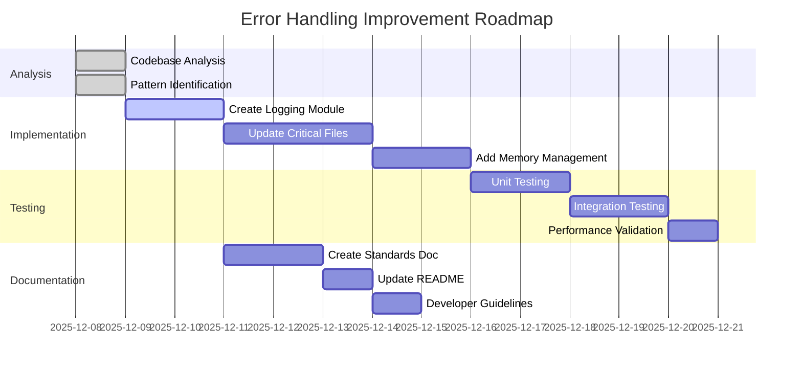

# Error Handling Improvement Plan

## Analysis Summary

Based on the codebase analysis, I've identified three major error-prone patterns:

### 1. Multiple try/except blocks that swallow exceptions without proper handling
- **Files affected**: `src/debug/debug_finra.py`, `src/debug/check_npy.py`, `src/feature_store/engine.py`, `src/etl/ingest/ingest_market_to_bronze.py`, `src/etl/standardization/standardize.py`, `src/etl/ingest/ingest_finra_to_bronze.py`, `src/features/dump_schema.py`
- **Issue**: Generic `except Exception as e:` blocks with simple `print()` statements that don't provide proper error context or recovery mechanisms
- **Example**: `except Exception as e: print(f"Error reading {f}: {e}")`

### 2. Inconsistent error logging
- **Files affected**: Most files use `print()` for errors, while `src/etl/bronze_data_pipeline.py` uses a proper logging system
- **Issue**: Mix of `print()` statements and proper logging, making it difficult to track and manage errors systematically
- **Example**: Some files use `logger.log_error()` while others use `print(f"Error: {e}")`

### 3. Potential memory leaks in data processing loops
- **Files affected**: `src/models/train_mlx.py`, `src/data/check_data_quality.py`, `src/data/hybrid_loader.py`, `src/etl/standardization/standardize.py`, `src/etl/ingest/ingest_market_to_bronze.py`
- **Issue**: Large data processing loops without proper resource cleanup, especially in pandas/polars data processing
- **Example**: Loops that process large datasets without explicit garbage collection or context managers

## Detailed Improvement Plan

### Phase 1: Standardized Error Handling Guidelines

**Objective**: Create consistent error handling patterns across the codebase

**Actions**:
1. **Create error handling standards document** (`error_handling_standards.md`)
2. **Define error severity levels**:
   - CRITICAL: System failures that require immediate attention
   - ERROR: Functional failures that prevent operation completion
   - WARNING: Non-critical issues that should be addressed
   - INFO: Informational messages about normal operation
   - DEBUG: Detailed debugging information

3. **Standardize exception handling patterns**:
   ```python
   # GOOD: Specific exception handling with context
   try:
       # Operation
   except FileNotFoundError as e:
       logger.error(f"File not found: {file_path} - {str(e)}")
       raise FileProcessingError(f"Cannot process {file_path}") from e
   except ValueError as e:
       logger.warning(f"Data validation failed: {str(e)}")
       # Handle gracefully
   except Exception as e:
       logger.critical(f"Unexpected error in {context}: {str(e)}")
       raise
   ```

### Phase 2: Implement Proper Logging System

**Objective**: Replace inconsistent logging with standardized logging system

**Actions**:
1. **Create centralized logging module** (`src/utils/logging.py`)
2. **Standardize log format**: `[TIMESTAMP] [LEVEL] [MODULE] [MESSAGE]`
3. **Implement log rotation** for production environments
4. **Add context to all log messages** including:
   - Module/function name
   - Relevant data identifiers (file paths, CIKs, etc.)
   - Error codes for critical failures

**Implementation Example**:
```python
# src/utils/logging.py
import logging
from typing import Optional

class DataStoreLogger:
    def __init__(self, name: str = "datastore"):
        self.logger = logging.getLogger(name)
        self.logger.setLevel(logging.DEBUG)

        # Console handler
        ch = logging.StreamHandler()
        ch.setLevel(logging.INFO)
        formatter = logging.Formatter('%(asctime)s - %(name)s - %(levelname)s - %(message)s')
        ch.setFormatter(formatter)

        # File handler with rotation
        fh = logging.FileHandler('logs/datastore.log')
        fh.setLevel(logging.DEBUG)
        fh.setFormatter(formatter)

        self.logger.addHandler(ch)
        self.logger.addHandler(fh)

    def critical(self, message: str, context: Optional[str] = None):
        full_msg = f"{context}: {message}" if context else message
        self.logger.critical(full_msg)

    def error(self, message: str, context: Optional[str] = None):
        full_msg = f"{context}: {message}" if context else message
        self.logger.error(full_msg)

    # ... other log levels
```

### Phase 3: Memory Management Improvements

**Objective**: Prevent memory leaks in data processing loops

**Actions**:
1. **Add explicit resource cleanup** in data processing functions
2. **Implement context managers** for file operations
3. **Add memory profiling** for critical data processing functions
4. **Implement batch processing with cleanup**:
   ```python
   def process_large_dataset(file_path: str, batch_size: int = 1000):
       logger.info(f"Starting processing of {file_path}")
       try:
           with pd.read_csv(file_path, chunksize=batch_size) as reader:
               for i, chunk in enumerate(reader):
                   try:
                       process_chunk(chunk)
                       if i % 10 == 0:
                           logger.debug(f"Processed batch {i}")
                           # Explicit cleanup
                           del chunk
                           gc.collect()
                   except Exception as e:
                       logger.error(f"Batch {i} processing failed: {str(e)}")
                       continue
       except Exception as e:
           logger.critical(f"Dataset processing failed: {str(e)}")
           raise
   ```

### Phase 4: Specific File Improvements

**Critical Files to Address**:

1. **`src/debug/debug_finra.py`** - Replace print statements with proper logging
2. **`src/debug/check_npy.py`** - Add proper exception handling
3. **`src/feature_store/engine.py`** - Standardize error handling
4. **`src/etl/ingest/*.py`** - Add proper logging and memory management
5. **`src/etl/standardization/standardize.py`** - Improve error handling and logging
6. **`src/models/train_mlx.py`** - Add memory management to training loops

### Phase 5: Testing and Validation

**Objective**: Ensure improvements don't break existing functionality

**Actions**:
1. **Create test suite** for error handling scenarios
2. **Add memory usage tests** for data processing functions
3. **Implement logging validation** to ensure all critical paths are logged
4. **Performance benchmarking** to ensure no regression

## Implementation Roadmap



## Success Metrics

1. **Error Handling Coverage**: 100% of critical code paths have proper error handling
2. **Logging Consistency**: All modules use standardized logging system
3. **Memory Efficiency**: No memory leaks detected in data processing
4. **Code Maintainability**: Improved code readability and debuggability
5. **Failure Recovery**: System can gracefully handle and recover from 90% of expected errors

## Risk Assessment

**High Risk**:
- Changing error handling in critical data processing pipelines
- Memory management changes affecting performance

**Mitigation**:
- Incremental implementation with thorough testing
- Performance benchmarking before and after changes
- Maintain backward compatibility where possible