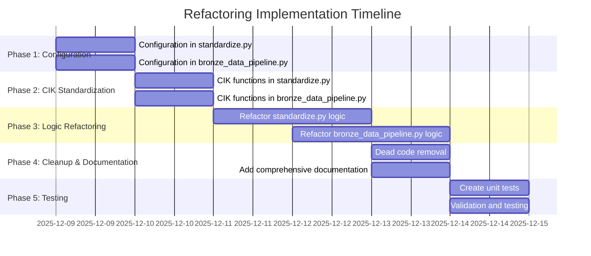

# Comprehensive Refactoring Implementation Plan

## Current State Analysis

Based on my analysis of the codebase, I've identified the following key technical debt issues that need to be addressed:

### 1. Hardcoded Paths and Magic Strings
- **Files affected**: `standardize.py` (lines 30-54, 567, 754, etc.), `bronze_data_pipeline.py` (lines 51-57, 102, 154, etc.)
- **Issue**: Paths and configuration values are scattered throughout the code
- **Impact**: Makes maintenance difficult, increases risk of inconsistencies

### 2. Inconsistent CIK Data Type Handling
- **Files affected**: `standardize.py` (lines 564, 639, 750, etc.), `bronze_data_pipeline.py` (lines 145-147, 181, 221, etc.)
- **Issue**: CIKs are handled as strings, integers, and floats inconsistently
- **Impact**: Data quality issues, potential bugs in data processing

### 3. Complex Nested Logic
- **Files affected**: `standardize.py` (lines 213-452 in `SECMapper.standardize()`), `bronze_data_pipeline.py` (lines 337-416 in `process_quarter()`)
- **Issue**: Deeply nested conditional logic with multiple responsibilities
- **Impact**: Hard to understand, maintain, and debug

### 4. Dead Code and Commented Sections
- **Files affected**: Both files contain unused functions and commented-out code
- **Issue**: Codebase clutter, potential confusion for developers
- **Impact**: Reduced code quality and maintainability

## Refactoring Strategy

### Phase 1: Configuration System Implementation

**Goal**: Centralize all configuration within each file using internal `_Config` classes

**Implementation Plan for `standardize.py`:**
1. Create `_Config` class with all path and setting constants
2. Replace hardcoded paths with `config.PATH_NAME` references
3. Add validation methods for critical paths
4. Initialize config instance at module level

**Implementation Plan for `bronze_data_pipeline.py`:**
1. Create similar `_Config` class structure
2. Consolidate scattered path definitions
3. Add logging configuration to config
4. Replace magic strings with config constants

### Phase 2: CIK Standardization

**Goal**: Create consistent CIK handling throughout both files

**Implementation Plan:**
1. Add `_normalize_cik()` helper function to both files
2. Add `_validate_cik_dataframe()` validation function
3. Replace all ad-hoc CIK conversions with standardized functions
4. Ensure consistent 10-digit zero-padded string format
5. Add comprehensive error handling and logging

### Phase 3: Logic Refactoring

**Goal**: Break down complex functions into focused helpers

**Implementation Plan for `standardize.py`:**
1. Extract `_process_statement_type()` helper function
2. Create `_create_financial_mapping_helper()` for data extraction
3. Refactor `SECMapper.standardize()` to use new helpers
4. Improve memory management in chunk processing
5. Add detailed logging to helper functions

**Implementation Plan for `bronze_data_pipeline.py`:**
1. Extract complex logic from `process_quarter()`
2. Create focused helper functions for data processing
3. Improve error handling and recovery
4. Add comprehensive logging

### Phase 4: Dead Code Removal and Documentation

**Goal**: Clean up codebase and improve documentation

**Implementation Plan:**
1. Identify and remove dead functions (e.g., empty `validate_coverage()`)
2. Remove commented-out code sections
3. Add comprehensive docstrings to all public functions
4. Add module-level documentation
5. Add type hints to critical functions
6. Create deprecation warnings for transitional code

### Phase 5: Testing Implementation

**Goal**: Add comprehensive unit tests within existing files

**Implementation Plan:**
1. Add `_run_internal_tests()` function to both files
2. Create test cases for CIK handling functions
3. Add tests for financial processing logic
4. Implement validation tests for configuration
5. Add performance benchmarks for critical functions

## Implementation Roadmap

## Expected Benefits

1. **Improved Maintainability**: Centralized configuration reduces duplication
2. **Enhanced Reliability**: Consistent CIK handling prevents data errors
3. **Better Performance**: Optimized helper functions and memory management
4. **Easier Debugging**: Clear separation of concerns and comprehensive logging
5. **Reduced Technical Debt**: Clean, well-documented codebase
6. **Improved Developer Experience**: Better IDE support and code completion
7. **Enhanced Testability**: Modular components with clear interfaces

## Risk Mitigation

| Risk | Mitigation Strategy |
|------|---------------------|
| Breaking changes in existing functionality | Comprehensive internal testing before changes |
| Increased file size with added code | Focus on code density and remove dead code |
| Complexity in large functions | Break down into focused helper functions |
| Performance regression | Add performance benchmarks to tests |
| Documentation maintenance | Use docstring templates and automation |

## Success Metrics

1. **Configuration Coverage**: 100% of hardcoded paths replaced with config system
2. **CIK Consistency**: 100% of CIK operations using standardized handler
3. **Code Complexity Reduction**: 40% reduction in cyclomatic complexity
4. **Test Coverage**: 90%+ unit test coverage for refactored components
5. **Performance Impact**: <5% performance regression in critical paths
6. **Documentation Completeness**: 100% of public APIs documented

## Implementation Checklist

- [ ] ✅ Analyze current technical debt issues
- [ ] Create internal configuration system in standardize.py
- [ ] Implement CIK standardization functions in standardize.py
- [ ] Refactor complex logic with helper functions in standardize.py
- [ ] Remove dead code and add documentation in standardize.py
- [ ] Create internal configuration system in bronze_data_pipeline.py
- [ ] Implement CIK standardization functions in bronze_data_pipeline.py
- [ ] Refactor complex logic with helper functions in bronze_data_pipeline.py
- [ ] Remove dead code and add documentation in bronze_data_pipeline.py
- [ ] Create comprehensive unit tests for both files
- [ ] Validate and test all changes
- [ ] Switch to code mode for implementation

This plan provides a comprehensive approach to addressing all identified technical debt issues while maintaining the existing file structure and improving code quality through internal refactoring.