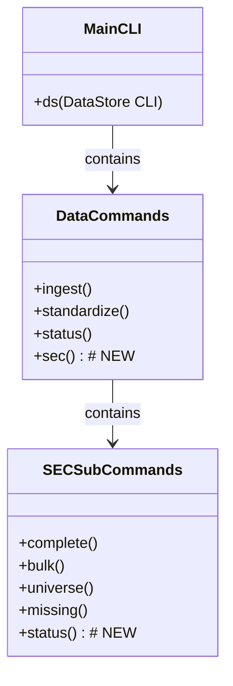

# SEC Data Pipeline CLI Enhancement Plan

## Current State Analysis

### Current CLI Implementation
- Basic `sys.argv` parsing with 4 commands: `complete`, `bulk`, `universe`, `missing`
- No proper argument validation or help system
- Limited functionality and no additional parameters
- Not integrated with the main DataStore CLI framework

### Existing CLI Framework
- Sophisticated Typer-based CLI in `src/cli/` with rich features
- Main entry point: `src/cli/main.py`
- Data commands: `src/cli/commands/data.py`
- Uses Typer for modern CLI experiences with help, validation, and rich output

## Proposed Enhancement Design

### New CLI Structure



### Enhanced CLI Features

#### 1. Main Command Structure
```
ds data sec [SUBCOMMAND] [OPTIONS]
```

#### 2. Subcommands with Enhanced Options

**Complete Pipeline:**
```
ds data sec complete [--batch-size INT] [--dry-run] [--verbose] [--force]
```
- `--batch-size`: Control batch size for missing CIK downloads (default: 100)
- `--dry-run`: Show what would be done without executing
- `--verbose`: Detailed logging
- `--force`: Force re-processing even if data exists

**Bulk Processing:**
```
ds data sec bulk [--quarters QUARTERS] [--dry-run] [--verbose] [--force]
```
- `--quarters`: Specific quarters to process (e.g., "2023q1,2023q2")
- `--dry-run`: Show what would be processed
- `--verbose`: Detailed processing logs
- `--force`: Force re-processing

**Universe Creation:**
```
ds data sec universe [--filter-foreign] [--min-market-cap FLOAT] [--dry-run] [--verbose]
```
- `--filter-foreign`: Exclude foreign filers (20-F/40-F)
- `--min-market-cap`: Minimum market cap threshold (default: $10M)
- `--dry-run`: Show universe creation plan
- `--verbose`: Detailed filtering logs

**Missing CIK Download:**
```
ds data sec missing [--batch-size INT] [--limit INT] [--dry-run] [--verbose]
```
- `--batch-size`: Download batch size (default: 100)
- `--limit`: Maximum number of missing CIKs to process
- `--dry-run`: Show what would be downloaded
- `--verbose`: Detailed download logs

**Status Command (NEW):**
```
ds data sec status [--detailed]
```
- Show current SEC data status
- `--detailed`: Show detailed breakdown by quarter/year

## Implementation Plan

### Phase 1: CLI Integration
1. **Update `src/cli/commands/data.py`**: Add `sec()` command that delegates to the new CLI
2. **Create `src/cli/commands/sec.py`**: New Typer-based CLI for SEC operations
3. **Update `src/etl/sec_data_pipeline.py`**: Replace basic CLI with proper argument parsing

### Phase 2: Enhanced Functionality
1. Add all new command options and parameters
2. Implement dry-run functionality
3. Add verbose logging support
4. Implement force processing options
5. Add status reporting

### Phase 3: Testing & Validation
1. Test each subcommand individually
2. Test argument validation
3. Test help system and documentation
4. Test integration with main CLI

## Technical Implementation Details

### Typer Integration
- Use `@typer.Typer()` for main SEC command group
- Use `@app.command()` for each subcommand
- Leverage Typer's automatic help generation
- Use rich console for beautiful output

### Argument Handling
- Use `typer.Argument()` for positional args
- Use `typer.Option()` for optional flags
- Add proper type hints and validation
- Implement custom validators where needed

### Error Handling
- Comprehensive error handling for CLI arguments
- Clear error messages with suggestions
- Graceful degradation on partial failures

## Migration Strategy

1. **Backward Compatibility**: Maintain support for old `python sec_data_pipeline.py [command]` syntax
2. **Progressive Enhancement**: New features available only through new CLI
3. **Documentation**: Update README with new CLI usage examples
4. **Deprecation**: Mark old CLI as deprecated with migration guide