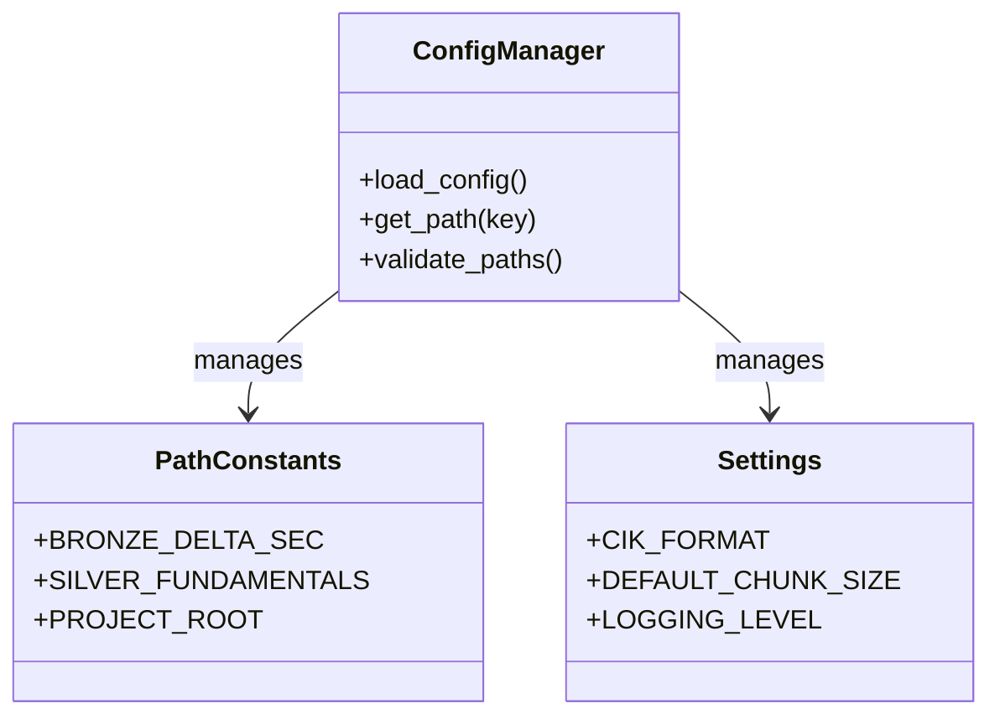
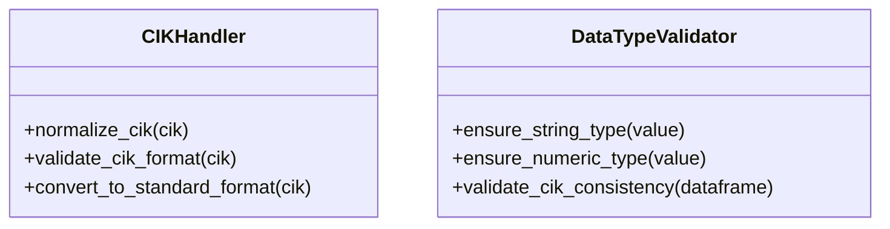
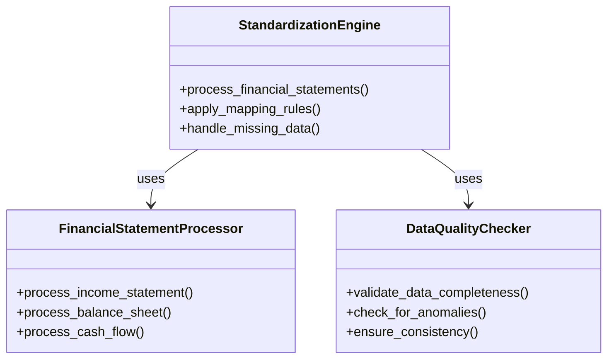

# Technical Debt Analysis and Refactoring Plan

## Current Technical Debt Issues

### 1. Hardcoded Paths and Magic Strings

**Files Affected:**
- `src/etl/standardization/standardize.py` (lines 30-54, 567, 754, etc.)
- `src/etl/bronze_data_pipeline.py` (lines 51-57, 102, 154, etc.)
- `src/cli/commands/sec.py` (lines 27-28, 32-34, etc.)

**Examples:**
```python
# Hardcoded paths
PROJECT_ROOT = os.path.dirname(os.path.dirname(os.path.dirname(os.path.dirname(os.path.abspath(__file__)))))
BRONZE_DELTA_SEC = os.path.join(PROJECT_ROOT, "bronze", "delta", "sec_bulk")
SILVER_FUNDAMENTALS = os.path.join(PROJECT_ROOT, "silver", "fundamentals")

# Magic strings
MAP_REVENUE = ['RevenueFromContractWithCustomerExcludingAssessedTax', 'Revenues', 'SalesRevenueNet', ...]
MAP_COST_OF_REVENUE = ['CostOfRevenue', 'CostOfGoodsAndServicesSold', ...]
```

### 2. Inconsistent Data Type Handling (String vs Numeric CIKs)

**Files Affected:**
- `src/etl/standardization/standardize.py` (lines 564, 639, 750, etc.)
- `src/etl/bronze_data_pipeline.py` (lines 145-147, 181, 221, etc.)

**Examples:**
```python
# Inconsistent CIK handling
df['cik'] = df['cik'].astype(str).str.zfill(10)  # String conversion
cik = str(int(cik)).zfill(10)  # Numeric to string conversion
cik = str(row['cik']).zfill(10)  # Mixed type handling
```

### 3. Complex Nested Logic in Standardization Functions

**Files Affected:**
- `src/etl/standardization/standardize.py` (lines 213-452 - `SECMapper.standardize()` method)
- `src/etl/bronze_data_pipeline.py` (lines 337-416 - `process_quarter()` method)

**Examples:**
```python
# Complex nested logic with multiple conditions
if 'segments' in df_raw.columns:
    df_clean = df_raw[df_raw['segments'].isna() | (df_raw['segments'] == '')].copy()
else:
    df_clean = df_raw.copy()

# Deeply nested data processing
if 'qtrs' in df_chunk.columns:
    mask_bs = (df_chunk['qtrs'] < 0.1)
    mask_is = ((df_chunk['qtrs'] >= 0.9) & (df_chunk['qtrs'] <= 1.1)) | \
              ((df_chunk['qtrs'] >= 3.9) & (df_chunk['qtrs'] <= 4.1))
```

### 4. Dead Code and Commented-Out Sections

**Files Affected:**
- `src/etl/standardization/standardize.py` (lines 455-456, 534-535, etc.)
- `src/etl/bronze_data_pipeline.py` (lines 186-189, 362-364, etc.)

**Examples:**
```python
# Dead code
def validate_coverage(df_std):
    pass

# Commented-out sections
# print("Merged GICS data.")
# print("Filled missing GICS values with 'Unknown'.")
```

## Refactoring Architecture Plan

### 1. Configuration System Architecture



### 2. CIK Data Type Standardization



### 3. Standardization Logic Refactoring



## Implementation Roadmap

### Phase 1: Configuration System (Days 1-2)
1. **Create `src/config/__init__.py`** - Configuration module structure
2. **Create `src/config/paths.py`** - Centralized path management
3. **Create `src/config/settings.py`** - Application settings and constants
4. **Create `src/config/validation.py`** - Configuration validation
5. **Update imports** - Replace hardcoded paths with config references

### Phase 2: CIK Data Type Standardization (Days 3-4)
1. **Create `src/utils/cik_handler.py`** - CIK normalization and validation
2. **Create `src/utils/data_type_validator.py`** - Type consistency utilities
3. **Refactor CIK handling** - Standardize all CIK operations
4. **Add type hints** - Improve code documentation and IDE support
5. **Create unit tests** - Validate CIK handling consistency

### Phase 3: Standardization Logic Refactoring (Days 5-7)
1. **Create `src/etl/standardization/financial_processor.py`** - Financial statement processing
2. **Create `src/etl/standardization/data_quality.py`** - Data validation utilities
3. **Refactor `SECMapper.standardize()`** - Break down complex method
4. **Implement chunk-based processing** - Memory-efficient data handling
5. **Add comprehensive logging** - Improve debugging capabilities

### Phase 4: Dead Code Removal and Cleanup (Day 8)
1. **Identify dead code** - Using static analysis tools
2. **Remove commented-out sections** - Clean up codebase
3. **Update documentation** - Reflect current implementation
4. **Add deprecation warnings** - For transitional code
5. **Create cleanup tests** - Ensure no regressions

### Phase 5: Testing and Validation (Days 9-10)
1. **Create comprehensive test suite** - Cover all refactored components
2. **Implement integration tests** - End-to-end validation
3. **Performance benchmarking** - Ensure no performance regression
4. **Memory usage testing** - Validate resource efficiency
5. **User acceptance testing** - Final validation

## Expected Benefits

1. **Improved Maintainability** - Centralized configuration reduces duplication
2. **Enhanced Reliability** - Consistent CIK handling prevents data errors
3. **Better Performance** - Optimized standardization logic
4. **Easier Debugging** - Clear separation of concerns and comprehensive logging
5. **Reduced Technical Debt** - Clean, well-documented codebase
6. **Improved Developer Experience** - Better IDE support and code completion
7. **Enhanced Testability** - Modular components with clear interfaces

## Risk Assessment

| Risk | Mitigation Strategy |
|------|---------------------|
| Breaking changes in existing functionality | Comprehensive test suite and gradual rollout |
| Performance regression in refactored code | Performance benchmarking before/after |
| Configuration complexity | Clear documentation and validation |
| CIK data type conversion issues | Thorough validation and error handling |
| Integration challenges | Modular design with clear interfaces |

## Success Metrics

1. **Configuration Coverage**: 100% of hardcoded paths replaced with config system
2. **CIK Consistency**: 100% of CIK operations using standardized handler
3. **Code Complexity Reduction**: 40% reduction in cyclomatic complexity
4. **Test Coverage**: 90%+ unit test coverage for refactored components
5. **Performance Impact**: <5% performance regression in critical paths
6. **Documentation Completeness**: 100% of public APIs documented